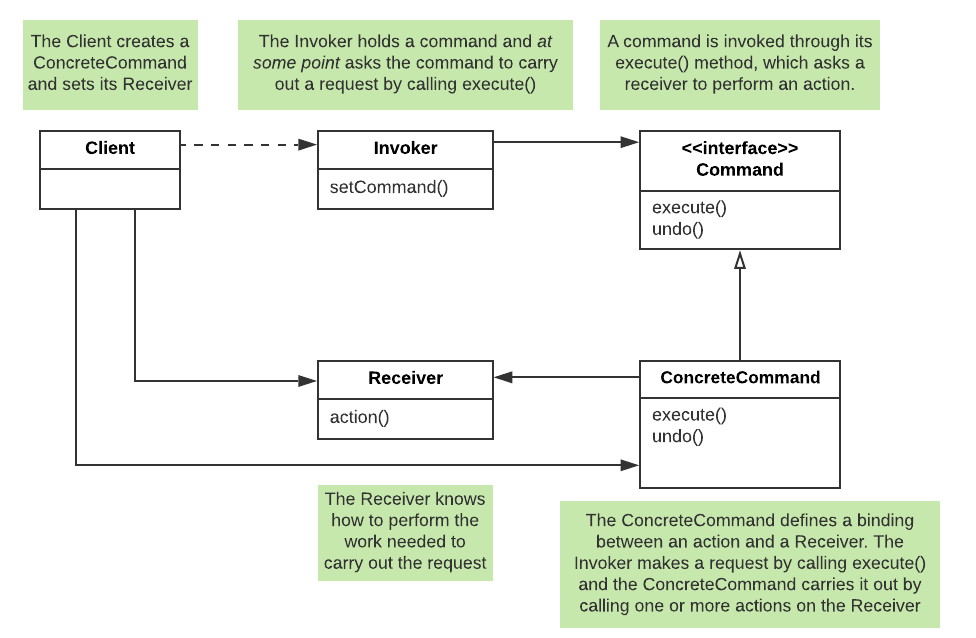
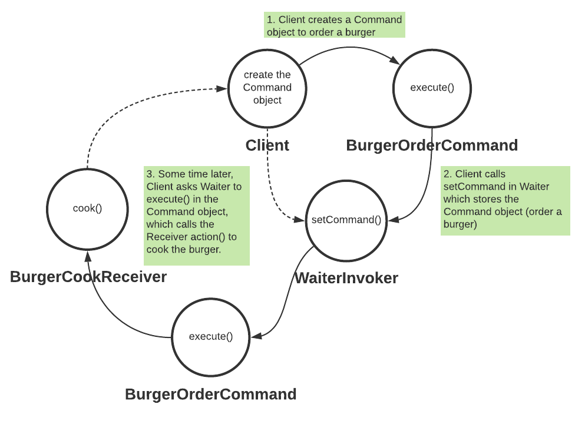

# Command Pattern

## Definition
Encapsulates a request (method invocation) as an object, thereby letting you parameterize other objects with 
different requests, queue or log requests, and support undoable operations. 

## Diagram

The main advantages for using the command pattern are:
- It decouples an object making a request (Client) from the object that receives (Invoker) and executes (Receiver) those requests. 
- The executor (Receiver) of the command does not need to know anything at all about what the command is, what context information it needs on or what it does. 
It hides the implementation details. 
- It allows easy extensions to add more commands/actions without changing existing code. 
- It can also parameterize and schedule or delay requests.

Read more about the benefits of the command pattern [here](https://stackoverflow.com/questions/32597736/why-should-i-use-the-command-design-pattern-while-i-can-easily-call-required-met).

## diner example

In this example, a client orders a burger. The waiter takes the order and passes it to the cook 
that cooks the burger. 

Without using the command pattern, we may have a single Java object that does both ordering and cooking. 
Mixing various functions makes the code less extensible.

Using the command pattern: 
- The client does not know anything about how a burger is cooked. It only needs to know how to order. 
- The order is then passed to the waiter, which also does not know how to cook the burger. Its role is to store the command as an object and passes to the cook. 
- The cook knows how to cook the burger, but it does not need to know who orders the burger and how the order is placed.

We may choose to implement the action() from `BurgerCookReiceiver` in `BurgerOrderCommand`, but then we will no longer have the same level of 
decoupling between the waiter and the cook. 

### Functional programming
In the command pattern, we treat the function (method) as an object and pass it around. 
This reminds us of **functional programming**, which treats functions as first-class citizens. It passes functions around the same way we pass objects around in OOP. 

Unlike Scala, Java is not a pure functional language. 
But functional style is supported by Java8+ in **functional interface**, which has only 1 method as in [`Command.java`](./diner/Command.java)

1. lambda expression
    - In [`ClientLambda.java`](./diner/ClientLambda.java), instead of creating the command object, we pass a lambda expression `() -> receiver.action()`.
    - We can only do this if the command interface has **only one** method that has a compatible signature with the lambda expression.
2. method reference
    - In [`ClientMethodReference.java`](./diner/ClientMethodReference.java), instead of passing a lambda expression, we can further simplifying it with method reference 
    by passing a reference to the method itself `receiver::action`. 
    - It is shorthand for lambda expression.

## jobQueue example
In this example, multiple clients can place multiple orders. We can store multiple commands in a List in [`Invoker`](./jobQueue/Invoker.java), and execute all of them later either sequentially or in parallel. 
Note the output order in the parallel execution may be different from sequential execution. 

Output from the sequential execution:
```
Commands executed in sequence
...
Burger is being cooked at medium
...
Soup is being cooked with chicken flavor
...
Fries are being cooked with size large
...
Burger is being cooked at rare
...
Soup is being cooked with beef flavor
...
Fries are being cooked with size small
...
Burger is being cooked at medium rare
```
Output from the parallel execution using `Thread`:
```
Commands executed in parallel
Command runs in thread Thread[main,5,main]
Command runs in thread Thread[ForkJoinPool.commonPool-worker-27,5,main]
Command runs in thread Thread[ForkJoinPool.commonPool-worker-23,5,main]
Command runs in thread Thread[ForkJoinPool.commonPool-worker-19,5,main]
Command runs in thread Thread[ForkJoinPool.commonPool-worker-5,5,main]
Command runs in thread Thread[ForkJoinPool.commonPool-worker-9,5,main]
Command runs in thread Thread[ForkJoinPool.commonPool-worker-13,5,main]
...
Fries are being cooked with size small
...
Fries are being cooked with size large
...
Burger is being cooked at rare
...
Burger is being cooked at medium
...
Burger is being cooked at medium rare
...
Soup is being cooked with chicken flavor
...
Soup is being cooked with beef flavor
```

## Command pattern v.s Callback function
According to [Wikipedia](https://en.wikipedia.org/wiki/Callback_%28computer_programming%29):

```
A callback, also known as a "call-after" function, is any executable code that is passed 
as an argument to other code; that other code is expected to call back (execute) the 
argument at a given time. This execution may be immediate as in a synchronous callback, 
or it might happen at a later time as in an asynchronous callback. 
```

`execute()` in the command pattern appears to be a callback. It is encapsulated and passed around as an object and invoked when needed.

The word `expected` means callback **notifies** the caller when a specific event happens, which can be implemented with the [Observer Pattern](../observer). 

## Use cases
See [Wikipedia](https://en.wikipedia.org/wiki/Command_pattern#Uses).

When implementing a protocol, we can use the command pattern to decouple the parsing of a byte stream from the action associated to the message. 
When the channel receives some byte from the wire, it constructs the right command object (e.g., using the prototype or abstract factory pattern) and put it in a queue to be executed later (possibly in another thread).