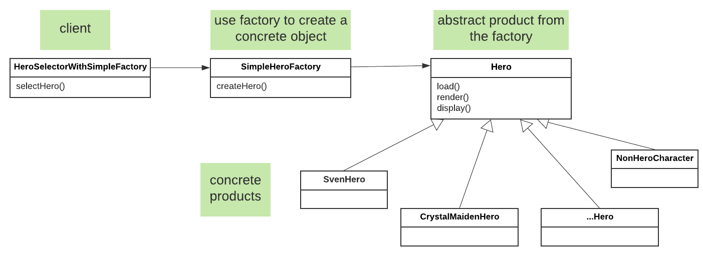
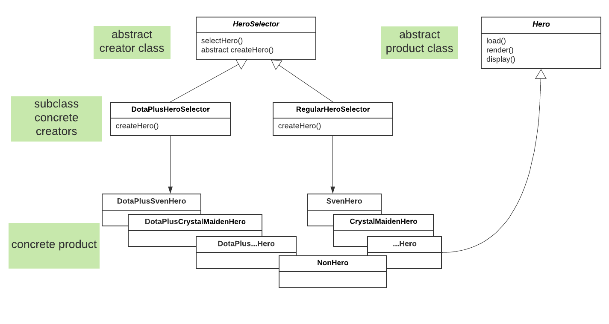
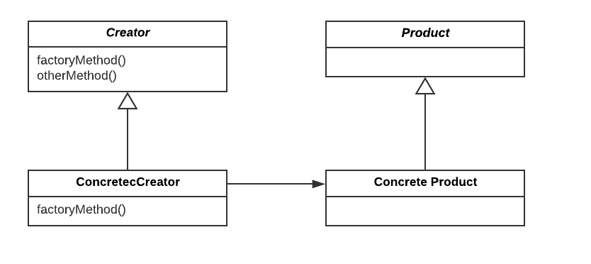
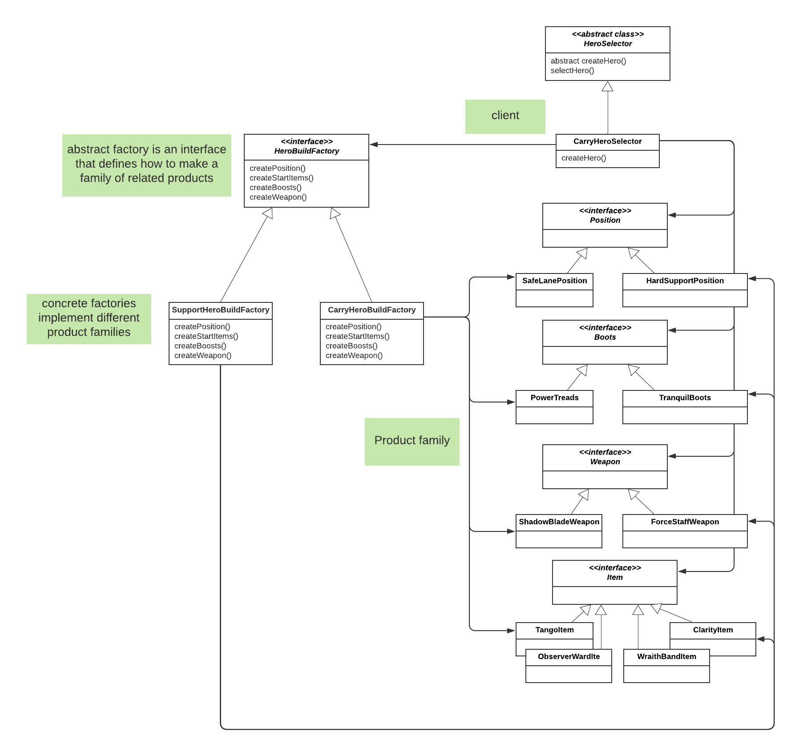

# Factory Pattern

## Definition
**Simple Factory**: not actually a design pattern, but more of a programming idiom. It encapsulates the create method for object creation. 

**Factory Method**: defines an interface for creating an object, and lets subclasses decide which class to **instantiate**.

**Abstract Factory**: provides an interface for creating families of **related or dependent** objects without 
specifying their **concrete** class


## 1. HeroSelector with Simple Factory


In this example, we want to build a **HeroSelector** that takes a selection of hero name in String,
and print out some information about a selected hero.

A straightforward implementation is `HeroSelector` which contains a `selectHero` method:
```
public Hero selectHero(String heroName){
    ...
    return hero;
}
```
                   
This method includes conditional statement to instantiate various `Hero` objects:
```
    if (heroName == "sven"){
        hero = new SvenHero();
    }
    else if (heroName == "sniper"){
        hero = new SniperHero();
    }
...
```
There is also additional code to print out behaviors of a selected hero:
```
    hero.load();
    hero.render();
    hero.display();
```
If we have new hero names, we will need to modify the conditional statements in `HeroSelector`, while the 
code about hero behaviors remains unchanged.          

As the code shows, we know what is **varying** (object creation with `new`) and what isn't (printing hero behaviors), 
so it is probably time to **encapsulate** the varying part. 

We can use `Factory` to encapsulate the details of object creation, 
and move the conditional statements to a separate class `SimpleHeroFactory`, 
which contains `createHero` method. 
```
public Hero createHero(String heroName){
    return hero;
}
```

The `HeroSelectorWithSimpleFactory` gets `SimpleHeroFactory` passed to its constructor:
```
public HeroSelectorWithSimpleFactory(SimpleHeroFactory factory){
    this.factory = factory;
}
```
The `selectHero` method uses the factory to create a concrete hero object:
```
hero = factory.createHero(heroName);
```

`createHero` can be defined as a static method, as in `SimpleHeroFactoryStatic`. With a static method, we do not need to instantiate 
an object to use the create method as shown in `HeroSelectorWithSimpleFactoryStatic`.

By encapsulating the `createHero` method in `SimpleHeroFactory`, we decouple **object creation** from how an object is **used**. 
In this example, the object `Hero` created from `SimpleHeroFactory` is used in `selectHero`. There can be other classes
that use the factory to get `Hero` for its properties and behaviors. By using `Factory`, we have only one place 
to make modifications when the implementation of `createHero` changes. 
                          
Output example:
```
...Loading hero from database
Hero name: Crystal Maiden
Hero attribute: Intelligence
Hero position: Hard Support
Hero abilities: 
   Crystal Nova
   Frostbite
   Arcane Aura
   Freezing Field
...Rendering
...Displaying 
I'm Crystal Maiden!
-- Selected hero Crystal Maiden
```

## 2. HeroSelector with Factory Method

Say we have two types of clients (users): paid subscription - `Dota Plus`, and unpaid - `Regular`. The two clients 
will create slighly different `Hero` objects when selecting a heroName. For example, `Dota Plus` may have additional tags 
`[Dota Plus]` for hero's name and abilities. 

Regular Crystal Maiden:
```
public CrystalMaidenHero(){
    name = "Crystal Maiden";
    attribute = "Intelligence";
    position = "Hard Support";
    abilities.add("Crystal Nova");
    abilities.add("Frostbite");
    abilities.add("Arcane Aura");
    abilities.add("Freezing Field");
}
```

Dota Plus Crystal Maiden:
```
public DotaPlusCrystalMaidenHero(){
    name = "[Dota Plus] Crystal Maiden";
    attribute = "Intelligence";
    position = "Hard Support";
    abilities.add("[Dota Plus] Crystal Nova");
    abilities.add("[Dota Plus] Frostbite");
    abilities.add("[Dota Plus] Arcane Aura");
    abilities.add("[Dota Plus] Freezing Field");
    extraVoiceLines.add("I've got goosebumps!");
    extraVoiceLines.add("Is it cold in here or is it just me?");
}
```
In this case, we make `createHero` an `abstract method` in original `HeroSelector` client, 
and then create `HeroSelector` subclasses for each different types of clients with their correponding 
`createHero` implementation. This is called the **Factory Method** pattern.



Factory method lets the subclass decide which class to instantiate at run time. The `Creator` class can be written 
without knowledge of the actual `Product` that will be created. 

Output example:
```
...Loading hero from database
Hero name: [Dota Plus] Crystal Maiden
Hero attribute: Intelligence
Hero position: Hard Support
Hero abilities: 
   [Dota Plus] Crystal Nova
   [Dota Plus] Frostbite
   [Dota Plus] Arcane Aura
   [Dota Plus] Freezing Field
Extra voice lines: 
   I've got goosebumps!
   Is it cold in here or is it just me?
...Rendering
...Displaying 
[Dota Plus] I'm Crystal Maiden! My primary attribute is Intelligence
-- Selected hero [Dota Plus] Crystal Maiden
```

It is easy to accommodate new changes when there is a new implementation for the factory method. 

In `heroFactoryMethodV2`, we have a new client `BattlePassHeroSelector` which creates new types of `Heros` 
with the `[Battle Pass]` tag. 

Battle Pass Crystal Maiden:
```
public BattlePassCrystalMaidenHero(){
    name = "[Battle Pass] Crystal Maiden";
    attribute = "Intelligence";
    position = "Hard Support";
    abilities.add("[Battle Pass] Crystal Nova");
    abilities.add("[Battle Pass] Frostbite");
    abilities.add("[Battle Pass] Arcane Aura");
    abilities.add("[Battle Pass] Freezing Field");
    extraVoiceLines.add("I've got goosebumps!");
    extraVoiceLines.add("Is it cold in here or is it just me?");
}
```
To add this new type of `HeroSelector`, we keep all the code in `heroFactoryMethod` unchanged, 
and only add a few new `Hero` classes and a new concrete implementation of the factory method:
```$xslt
public class BattlePassHeroSelector extends HeroSelector {
    public Hero createHero(String heroName){
```

## 3. HeroSelector with Abstract Factory

Note that a `Hero` may have arbitrarily defined properties such as `position`. But in reality, we may want to 
ensure consistency in a Hero's properties. For example, we may only allow the client to select among a set of predefined 
values for `position`, `weapon` and `boots`. 

In this example, we are building a `Hero` with different roles: `Carry` and `Support`. 
Each role uses one set of `HeroBuild` that include family of objects such as `Position`, `Boots`, `Weapon`, and a list of `Item`. 
```
public abstract class Hero {
    public String name;
    public Position position;
    public Boots boots;
    public Weapon weapon;
    public ArrayList<Item> startItems;
}
```
We are going to build a factory interface to create our `HeroBuild`. This interface creates families of related or dependent pbjects
without specifying their concrete classes. This is called the **Abstract Factory** pattern.
```
public interface HeroBuildFactory {
    Position createPosition();
    ArrayList<Item> createStartItems();
    Boots createBoosts();
    Weapon createWeapon();
}
```
We then implement `createMethod` in concrete `HeroBuildFactory` classes for Carry and Support:
```
public class CarryHeroBuildFactory implements HeroBuildFactory {
    @Override
    public Position createPosition() {
        return new SafeLanePosition();
    }
    ...
}
public class SupportHeroBuildFactory implements HeroBuildFactory {
    @Override
    public Position createPosition() {
        return new HardSupportPosition();
    }
    ...
}
```
The concrete `HeroBuildFactory` uses `Factory Method` to instantiate a family of objects for each `HeroBuild`. 

Output example:
```
...Loading hero from database
...Rendering
...Displaying 
I have a build with boots!
...Selected Hero Build
---- Support Build with Boots ----
Position: Hard Support
With boots: Tranquil Boots
With start items: Tango, Observer Ward, Clarity
```

It is easy to accommodate new changes when there is a new concrete factory. In `heroAbstractFactoryV2`, we have a new factory for `OffLaneHeroBuild`.
We create a new family of products for this factory. Everything else in the original abstract factory is not affected by this new addition of factory. 

## Note
When we use `Factory Method` or `Abstract Factory` pattern, we end up creating a lot more classes and files to encapsulate what varies, 
program to interface, and make our classes open for extension but closed for modification - all of these are OO principles. In practice, we need to 
weigh the benefits of clean code and the added work of creating and maintaining various classes. 