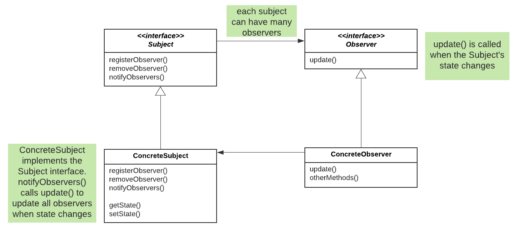
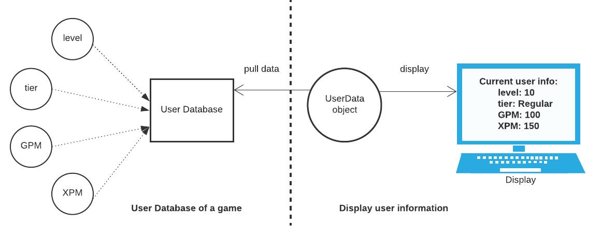
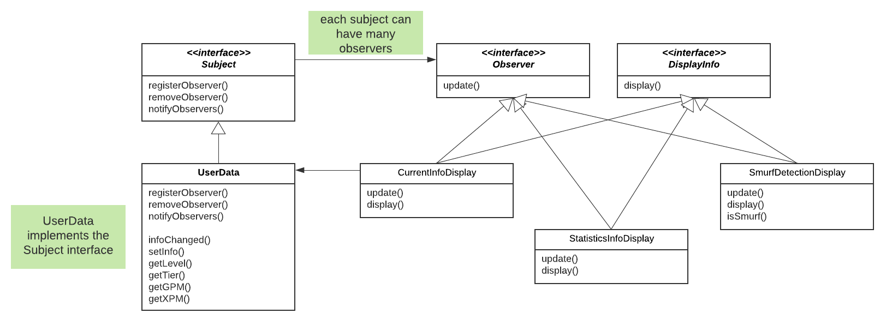
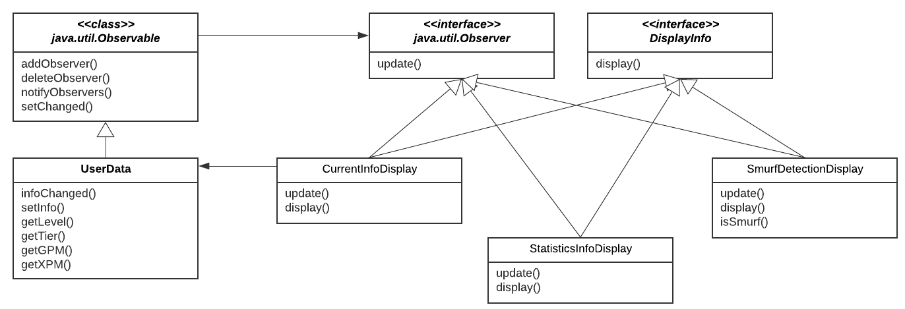
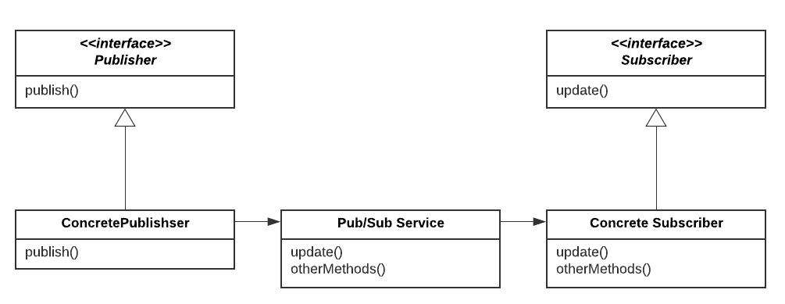
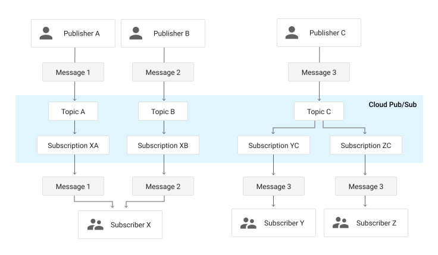

# Observer Pattern

## Definition
Defines a one-to-many dependency between objects so that when one object changes state, all of its dependents are notified 
and updated automatically.



## 1. Game User Display
In this example, we are building a game user display to show user's information. 


**User Database** collects various information about a user, such as `level` and `GPM` (goldPerMinute), and the `UserData` object 
pulls data from the User Database to get updated data. The `UserData` object then **updates** its display when there is a change 
in User Database. In the diagram above, we only have 1 display to show current user information. 

Now we want to show different user information as the diagram below:


We apply the **Observer Pattern** here. 
The concrete subject `UserData` keeps a list of all observers in `ArrayList`. We can add and remove observers by modifying this list.
```
@Override
public void registerObserver(Observer o) {
    observers.add(o);
}

@Override
public void removeObserver(Observer o) {
    int i = observers.indexOf(o);
    if (i>=0){
        observers.remove(i); //or use remove(o). if not exist return false
    }
}
```

When the state changes, we use `notifyObservers` to update each observer in the list.

```
public void infoChanged() {
    System.out.println("...User info changed");
    notifyObservers();
}

@Override
public void notifyObservers() {
    for (int i = 0; i < observers.size(); i++){
        Observer observer = observers.get(i);
        observer.update(level, tier, goldPerMinute, experiencePerMinute);
    }
}
```

The `update` function is implemented in each concrete observer, and `display` different user information.
1) `CurrentInfoDisplay`: display current level, tier, GPM, XPM.
2) `StatisticsInfoDisplay`: compute and display average and maximum GPM and XPM.
3) `SmurfDetectionDisplay`: compute and display historical average XPM and current XPM, and compare them to decide whether a user is a smurf. 
Smurf tries to get accounts that are performing higher than expected to their correct rank faster, see [dota2](https://blog.dota2.com/2019/09/matchmaking-update-for-the-next-ranked-season/).
We want to detect when user has been clearly over performing, based on how the played heroes usually perform at a given rank. 
Here we implement a simple `isSmurf` function: `return (numGames > 1) && (currentXPM > 2 * historicalXPM);`.

Output example:
```
...User info set
...User info changed
Current user info: 
	level: 10
	tier: Regular
	GPM: 100.0
	XPM: 200.0
User statistics info: 
	Average user GPM: 100.0
	Average user XPM: 200.0
	Maximum user GPM: 100.0
	Maximum user XPM: 200.0
Simple Smurf Detection: 
	Historical user XPM: 0.0
	Current user XPM: 200.0
This user account is normal.
```

Note that when we set the state for `UserData` with `setInfo`, we call `infoChanged` which notifies observers to get updated. 
Essentially, the subject **pushes** new state to all observers. Alternatively, the observer can **pull** from the subject by calling 
public getter methods. Depending on the use case, we can implement either push or pull for the observer pattern. 

Using the observer pattern, we keep the subject and observer loosely coupled. We can add new observers easily without modifying the subject, 
and we can reuse the subjects and observers independent of each other. 

## 2. Game User Display with java.util
Java has built-in support for the observer pattern in the `java.util` package. With this package, we do not need to implement our own 
`add`, `remove`, `notify` method in the subject.



When the state changes, we must call `setChanged` to signify the changes. 

```
public void infoChanged() {
    System.out.println("...User info changed");
    setChanged();
    notifyObservers();
}
```

Both `Observable` and `Observer` have been deprecated since Java9. 
For a richer event model, consider using the `java.beans` package. 
For reliable and ordered messaging among threads, consider using one of the concurrent data structures in the `java.util.concurrent` package. 
See [Java documentation](https://docs.oracle.com/en/java/javase/11/docs/api/java.base/java/util/Observable.html).

The observer pattern notifies observers when some event happened. 
There are a few other patterns that are similar to the observer pattern (see [link](https://stackoverflow.com/questions/8951276/callback-command-vs-eventlistener-observer-pattern)):
1) Callback pattern: Trigger operations and notify the caller **asynchronously** that the triggered operation finished. Discussed later. 
2) Command pattern: **Encapsulates** an operation call in an object thus making it transferable over a wire. Discussed later. 
3) Pub/Sub pattern: See below. 

## Pub/Sub Pattern
A messaging pattern where senders of messages, called publishers, 
do not program the messages to be sent directly to specific receivers, called subscribers, 
but instead categorize published messages into classes without knowledge of which subscribers, if any, there may be. 
Similarly, subscribers express interest in one or more classes and only receive messages that are of interest, 
without knowledge of which publishers, if any, there are. ([Wikipedia](https://en.wikipedia.org/wiki/Publish%E2%80%93subscribe_pattern))



The primary differences between the Pub/Sub pattern and the observer pattern are:
1) In the observer pattern, the subject maintains a list of observers and the observers are aware of the subject. 
In the pattern, publishers and subscribers do not need to know each other. They communicate through a broker (message queue). 
As a result, the Pub/Sub pattern is more loosely coupled than the observer pattern. 
2) The observer pattern is mostly implemented synchronously: when state changes, subject notifies all observers. 
The Pub/Sub pattern is mostly implemented asynchronsly using message queues.
3) The observer pattern needs to be implemented in a single application address space. 
The Pub/Sub pattern is more of a cross-application pattern.


See [reference](https://medium.com/better-programming/observer-vs-pub-sub-pattern-50d3b27f838c).

## 3. Game User Display with the Pub/Sub pattern
Here, we implement the game user display with the Pub/Sub pattern. 
Code is adapted from this [post](http://www.code2succeed.com/pub-sub/).

The broker `PubSubService` implements a message queue to hold messages published from `Publisher` and a topic-subscribers hashmap. 
It has a push method `broadcast` to send messages to all subscribers, 
and a `pull` method `getMessagesOfTopic` to send messages to a single subscriber. 

`Publisher` has a single method `publish`, which adds a new message to the message queue in `PubSubService`.  

`Subscriber` adds and removes subscribers to the topic-subscribers hashmap in `PubSubService`, and uses the pull method `getMessagesOfTopic` to get messages from the `PubSubService`.

The key component here is a message queue in the broker. 

Outcome example:
```
>>> Messages of currentInfoDisplaySubscriberRanked are: 
Topic -> RANKED
Current user info: 
	level: 10
	tier: Regular
	GPM: 100.0
	XPM: 200.0
>>> Messages of currentInfoDisplaySubscriberUnranked are: 
Topic -> UNRANKED
Current user info: 
	level: 11
	tier: Regular
	GPM: 500.0
	XPM: 900.0
>>> Messages of currentInfoDisplaySubscriberAll are: 
Topic -> RANKED
Current user info: 
	level: 10
	tier: Regular
	GPM: 100.0
	XPM: 200.0
Topic -> UNRANKED
Current user info: 
	level: 11
	tier: Regular
	GPM: 500.0
	XPM: 900.0
>>> Messages of statisticsInfoDisplaySubscriberRanked are: 
Topic -> RANKED
User statistics info: 
	Average user GPM: 100.0
	Average user XPM: 200.0
	Maximum user GPM: 100.0
	Maximum user XPM: 200.0
>>> Messages of smurfDetectionDisplaySubscriberRanked are: 
Topic -> RANKED
Simple Smurf Detection: 
	Historical user XPM: 0.0
	Current user XPM: 200.0
This user account is normal.
```

## Google's Pub/Sub service
See [documentation](https://cloud.google.com/pubsub/docs/overview) and 
Java implementation [code](https://github.com/googleapis/java-pubsub/tree/master/google-cloud-pubsub/src/main/java/com/google/cloud/pubsub/v1).
