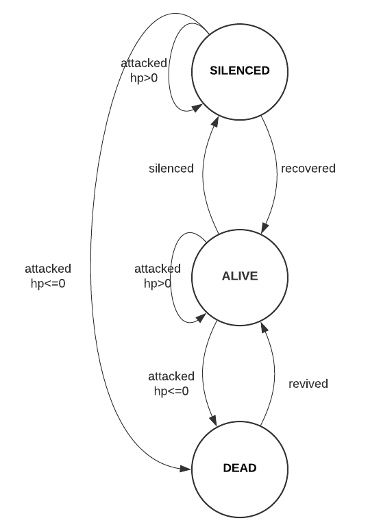
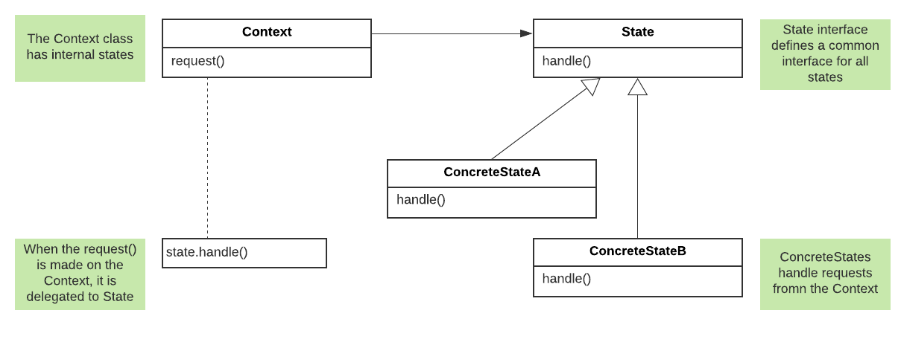
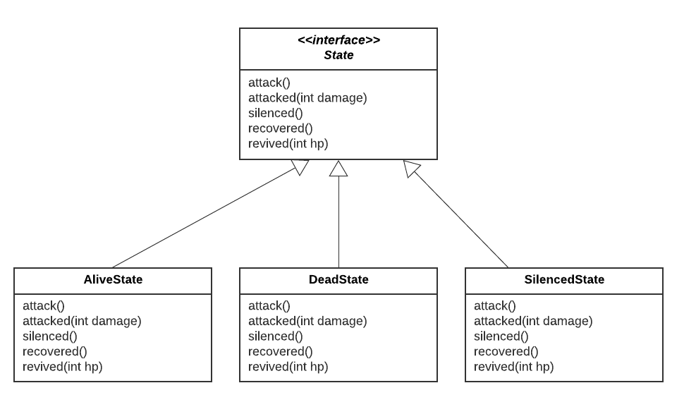
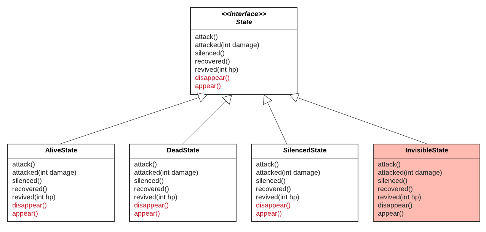
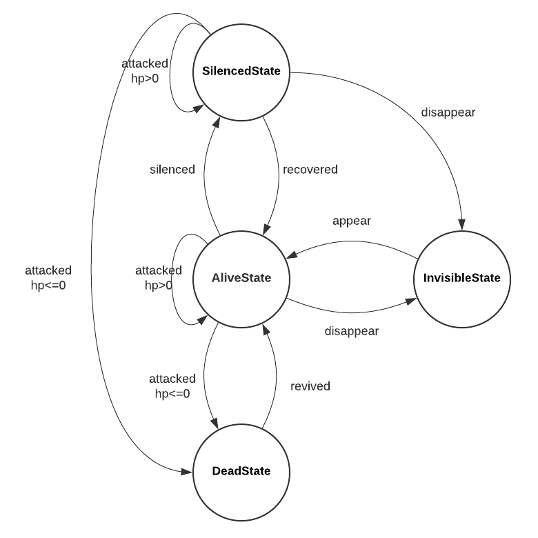

# State Pattern

## Definition
Allows an object to alter its behaviors when its internal state changes. 
The object will appear to change in class. It encapsulates states into separate classes 
and delegates behaviors to the object representing the current state. 

## State pattern and state machine
These two concepts are closely related and sometimes used interchangeably. 
However, they are different in their focus. 
- State pattern abstracts the states and focuses on varying **behaviors** of a state. It doesn't mean to address the transition. 
- State machine abstracts the state diagram and focuses on the **transition** between states. It doesn't mean to address the behaviors in each state. 

See [Wikipedia](https://en.wikipedia.org/wiki/State_pattern) and [StackOverflow](https://stackoverflow.com/questions/19859531/what-is-the-difference-between-a-state-machine-and-the-implementation-of-the-sta).
## HeroStateV1


In this example, a `Hero` can be in one of the 3 states: `ALIVE, DEAD, SILENCED` defined in [`HeroContext`](./heroStateV1/HeroContext.java)

When a Hero is `ALIVE` with `hp>0`, it can `attack`, and can be `attacked` and `silenced`. 
- When `attacked`, its `hp` is decreased by `damage`. If `hp<=0`, a Hero enters the state of `DEAD` with `hp=0`.
- When `silenced`, a Hero enters the state of `SILENCED`. 

When a Hero is `DEAD` with `hp=0`, it can be `revived`.
- When `revived`, a Hero enters the state of `ALIVE` with full hp. 

When a Hero is `SILENCED`, it can be `attacked` and `recovered`.
- When `attacked`, its `hp` is decreased by `damage`. If `hp<=0`, a Hero enters the state of `DEAD` with `hp=0`.
- When `recovered`, a Hero enters the state of `ALIVE`. 

If we have a new `State` or a new `behavior`, we will have to modify code in `HeroContext`.

Example output:
```
Hero Context
================
Hero HP 10
Hero is alive

...Hero is being attacked with damage: 5

Hero Context
================
Hero HP 5
Hero is alive

...Hero is attacking others.

Hero Context
================
Hero HP 5
Hero is alive

...Hero is already recovered, and cannot be recovered.

...Hero is already alive, and cannot be revived.

...Hero is being attacked with damage: 10

Hero Context
================
Hero HP 0
Hero is dead

...Hero is dead, and cannot attack others.

...Hero is dead, and cannot be attacked.

...Hero is dead, and cannot be recovered.

...Hero is dead, and cannot be silenced.

...Hero is being revived.

Hero Context
================
Hero HP 10
Hero is alive

...Hero is being silenced.

Hero Context
================
Hero HP 10
Hero is silenced

...Hero is silenced and cannot attack others.

...Hero is already silenced and cannot be silenced again.

...Hero is already alive but silenced, and cannot be revived.

...Hero is being attacked with damage: 5

Hero Context
================
Hero HP 5
Hero is silenced

...Hero is being recovered.

Hero Context
================
Hero HP 5
Hero is alive

...Hero is being silenced.

...Hero is being attacked with damage: 10

Hero Context
================
Hero HP 0
Hero is dead

...Hero is being revived.

Hero Context
================
Hero HP 10
Hero is alive
```

## HeroStateV2
Here we are applying the **State Pattern** with [`HeroContext`](./heroStateV2/HeroContext.java) and [`State`](./heroStateV2/State.java)


- create a `State` interface with all possible behaviors (actions).
- implement the `State` interface in concrete classes, each class has its own implementation for all bebaviors.
- `HeroContext` includes all different `State` and calls `state.handle()`. All behaviors `handle()` are delegated to `State`. 



We can think of the State Pattern as an alternative to having a lot of `if-else` conditions in the context. 

Using the **State Pattern**, we encapsulate what varies (behaviors) in `State` classes and usually have to create more classes in the design. 
The client `HeroContext` knows very little about the state object. The current state of the context changes across a set of 
state objects to reflect its internal state, and the behaviors of the context changes as well. 
When we call `context.handle()`, depending on the current state of the context, the behaviors vary. 

Example output is the same as before. 

## HeroStateV3
Here we have two new behaviors `disappear, appear` (in red) associated with a new state `InvisibleState`. 


Using **State Pattern**, we can keep `HeroContext` mostly unchanged.
- When we have a new `behavior`, we can modify the `State` interface and implement this behavior in `State` classes. 
- When we have a new `State`, we can easily create a new class implementing `State` interface and define its behaviors. 

The state transition graph is shown below:


Example output:
```
Hero Context
================
Hero HP 10
Hero is alive

...Hero is being attacked with damage: 5

Hero Context
================
Hero HP 5
Hero is alive

...Hero is attacking others.

Hero Context
================
Hero HP 5
Hero is alive

...Hero is already visible, and cannot appear.

...Hero is already recovered, and cannot be recovered.

...Hero is already alive, and cannot be revived.

...Hero disappears.

Hero Context
================
Hero HP 5
Hero is invisible

...Hero is already invisible, and cannot disappear.

...Hero is invisible and cannot be attacked.

...Hero is invisible and cannot be silenced.

...Hero is already recovered, and cannot be recovered.

...Hero is already alive, and cannot be revived.

...Hero is attacking others.

Hero Context
================
Hero HP 5
Hero is invisible

...Hero appears.

Hero Context
================
Hero HP 5
Hero is alive

...Hero is being attacked with damage: 10

Hero Context
================
Hero HP 0
Hero is dead

...Hero is dead, and cannot appear.

...Hero is dead, and cannot disappear.

...Hero is dead, and cannot attack others.

...Hero is dead, and cannot be attacked.

...Hero is dead, and cannot be recovered.

...Hero is dead, and cannot be silenced.

...Hero is being revived.

Hero Context
================
Hero HP 10
Hero is alive

...Hero is being silenced.

Hero Context
================
Hero HP 10
Hero is silenced

...Hero is already visible, and cannot appear.

...Hero is silenced and cannot attack others.

...Hero is already silenced and cannot be silenced again.

...Hero is already alive but silenced, and cannot be revived.

...Hero disappears.

Hero Context
================
Hero HP 10
Hero is invisible

...Hero appears.

...Hero is being attacked with damage: 5

Hero Context
================
Hero HP 5
Hero is alive

...Hero is already recovered, and cannot be recovered.

Hero Context
================
Hero HP 5
Hero is alive

...Hero is being silenced.

...Hero is being attacked with damage: 10

Hero Context
================
Hero HP 0
Hero is dead

...Hero is being revived.

Hero Context
================
Hero HP 10
Hero is alive
```

## Real life use cases
1. Uber trip booking: [State Machine Design pattern — Part 2: State Pattern vs. State Machine](https://medium.com/datadriveninvestor/state-machine-design-pattern-part-2-state-pattern-vs-state-machine-3010dd0fcf28)
2. E-commerce ordering, food ordering, and trip booking: [Finite State Machines + Android + Kotlin = Good Times](https://thoughtbot.com/blog/finite-state-machines-android-kotlin-good-times)
3. Mobile app UI activity flow: [State Machine Design pattern —Part 1: When, Why & How](https://medium.com/datadriveninvestor/state-machine-design-pattern-why-how-example-through-spring-state-machine-part-1-f13872d68c2d)
4. Workflow engine (sequential pattern): [WORKFLOW ENGINE VS. STATE MACHINE](https://workflowengine.io/blog/workflow-engine-vs-state-machine/)