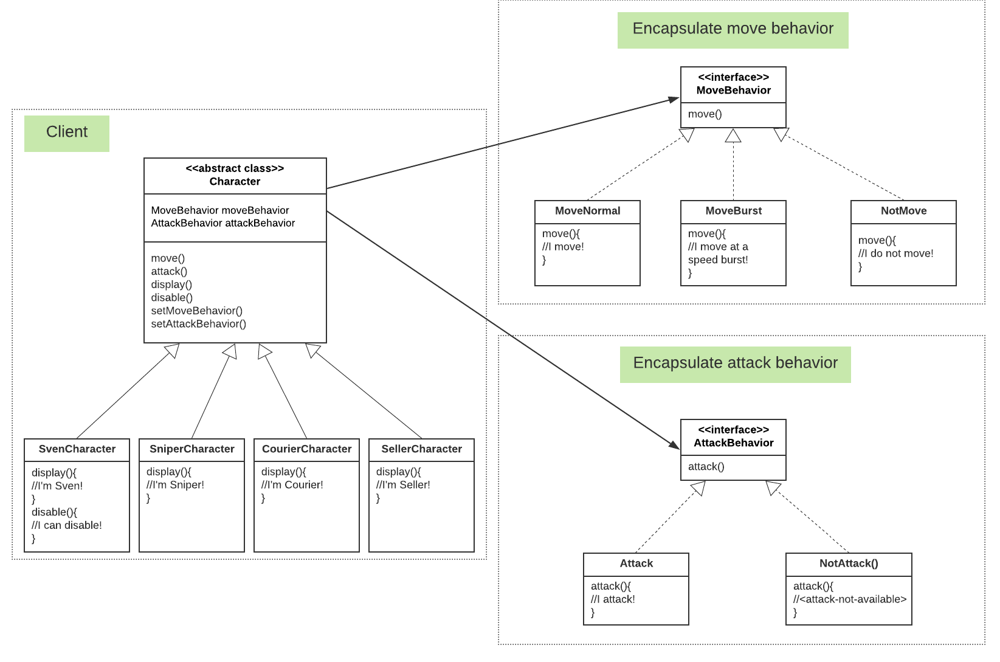

# Strategy Pattern Example

## Definition
- Defines a **family** of algorithms, **encapsulates** each one, and makes them **interchangeable**. 
- Lets the algorithms vary **independently** from clients that use it.

## Code example 
In this example, we will build a `Character` simulator of [Dota2 Characters](http://www.dota2.com/heroes/). 



`Character` is an `abstract class` that has 2 behaviors to be initialized: `MoveBehavior` and `AttackBebavior`. It also 6 methods: `move, attack, display, disable, setMoveBehavior, setAttackBehavior`.

There are 4 concrete `Character` classes: `SvenCharacter, SniperCharacter, CourierCharacter, SellerCharacter` that 
extends `Character`. These concrete classes have different behaviors. 

Note that  `MoveBehavior` and `AttackBebavior` are `interface` which encapsulates different types of behaviors. 

Run [CharacterSimulator.java](CharacterSimulator.java).

Output
```
...Displaying 
I'm Sven! My primary attribute is Strength
I have melee attack!
I move!
I can disable!
...Displaying 
I'm Sniper! My primary attribute is Agility
I have ranged attack!
I move!
...Displaying 
I'm Crystal Maiden! My primary attribute is Intelligence
I have ranged attack!
I move!
I can disable!
-- set move behavior
I move at a speed burst!
...Displaying 
I'm Courier!
<attack-not-available>
I move!
-- set move behavior
I move at a speed burst!
-- set attack behavior
I have ranged attack!
...Displaying 
I'm Seller!
<attack-not-available>
I do not move!
```